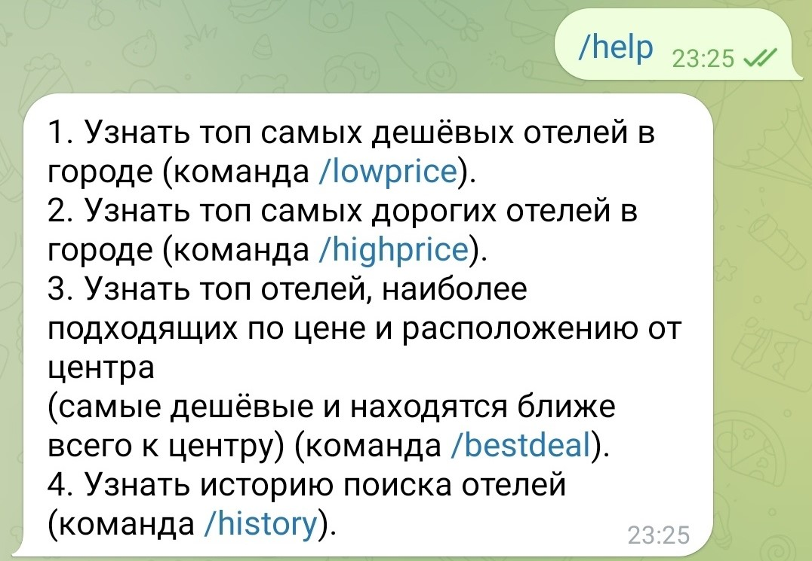
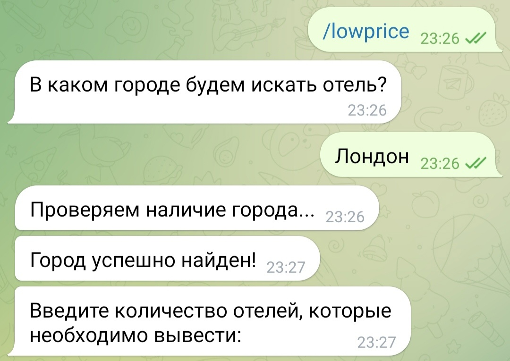
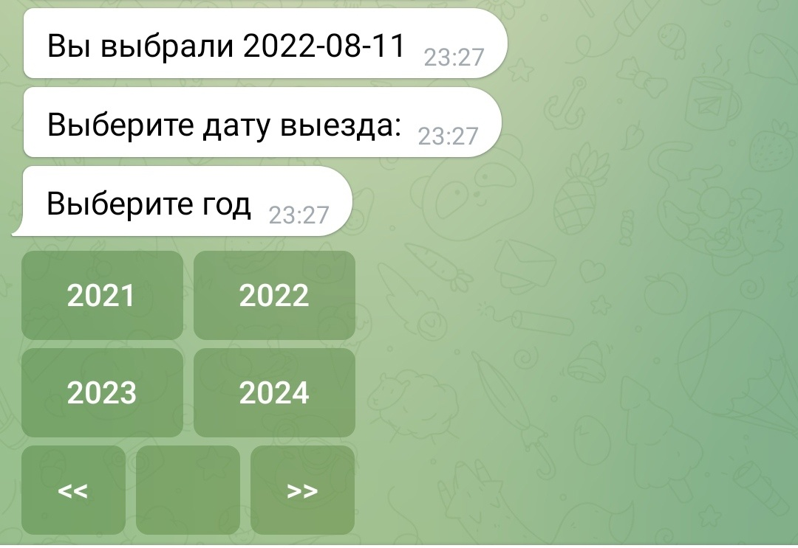
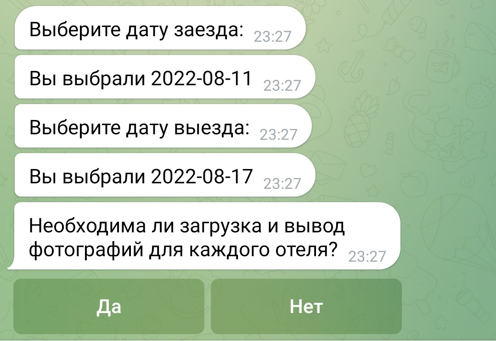
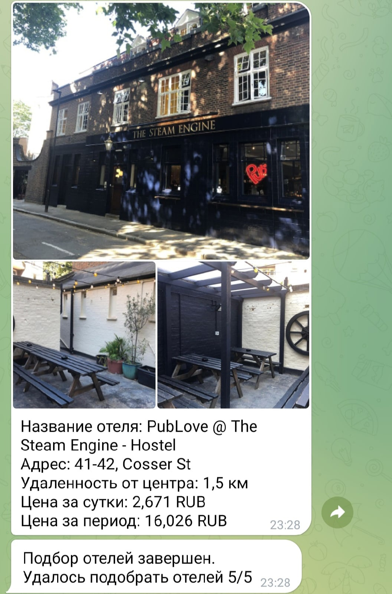
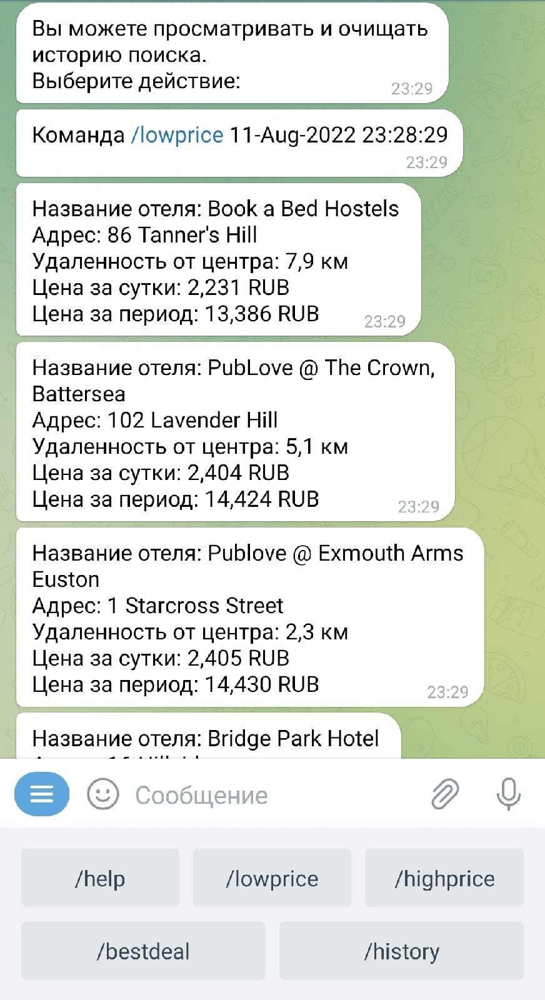

# Инструкция по эксплуатации телеграм-бота. 

## Перечень файлов проекта и краткое описание.
### Файлы в корне проекта:
1. **config.py** - файл содержащий базовые конфигурации бота
2. **create_bot.py** - файл для создания экземпляров бота и отлова исключений
3. **logging_config.py** - файл с конфигурациями логгера
4. **literals.py** - файл для замены текста в коде
5. **main.py** - запускает бота
6. **range_exception.py** - файл для сравнения и изменения атрибутов поиска
7. **readme.md** - инструкция по эксплуатации телеграмм-бота
8. **userstates.py** - файл для сохранения пользовательского состояния
### Пакеты в корне проекта:
#### 1.api_rapid:
* **init.py** - инициализирует пакет api_requests и его содержимое
* **request_city_id.py** - делает запросы к API для получения city_id
* **request_hotels.py** - делает запросы к API для поиска подходящих отелей
* **request_photo.py** - делает запросы к API для поиска фотографий отелей
* **search_address.py** - файл для поиска улицы или региона 
#### 2.database:
* **init.py** - инициализирует пакет database и его содержимое
* **userbase.py** - записывает пользовательские данные и найденные отели в БД
* **Users.db** - база данных sqlite  
#### 3.handlers:
* **init.py** - инициализирует пакет handlers и его содержимое
* **help.py** - логика работы команды help
* **menu.py** - содержит хэндлеры для отлова команд бота
* **lowprice_highprice.py** - логика работы команд: lowprice, highprice и bestdeal
* **bestdeal.py** - логика работы команды bestdeal (все отвлетвления из файла lowprice_highprice.py)
* **history.py** - логика работы команды history
#### 4.keyboards:
* **init.py** - инициализирует пакет keyboards и его содержимое
* **calendar.py** - содержит функции по созданию календарей и их обработчики
* **calendar_2.py** - содержит функции по созданию календарей и их обработчики
* **inline_keyboards.py** - содержит все inline-клавиатуры участвующие в проекте (исключение: calendar)
### Инструкция по эксплуатации:
Для запуска бота необходимо будет создать виртуальное окружение.  
Поместить токен-бота и API-ключ rapidapi.com в переменные окружения (Файл config.py).   
Далее запускаем бота в файле main.py
### Команды бота:
* **/start** - Запуск бота
* **/help** — помощь по командам бота,
* **/lowprice** — вывод самых дешёвых отелей в городе,
* **/highprice** — вывод самых дорогих отелей в городе,
* **/bestdeal** — вывод отелей, наиболее подходящих по цене и расположению от центра.
* **/history** — вывод истории поиска отелей
### Скриншоты бота (start):  

Запускаем бота

Команда help

Команда lowprice\
Вводим город для поиска отелей

Вводим количество отелей для поиска и выбираем год заезда

Выбираем день заезда 

Выбираем год выезда 

Выбираем день выезда

Выбираем выводить отели с фотографиями или без фотографий 

В случае положительного ответа выбираем количество фотографий к отелю

Поиск отелей

Результат поиска

На этом обработка команды lowprice завершена\
Команда history

История вызова команд и поиска отелей

На этом обработка команды history завершена

