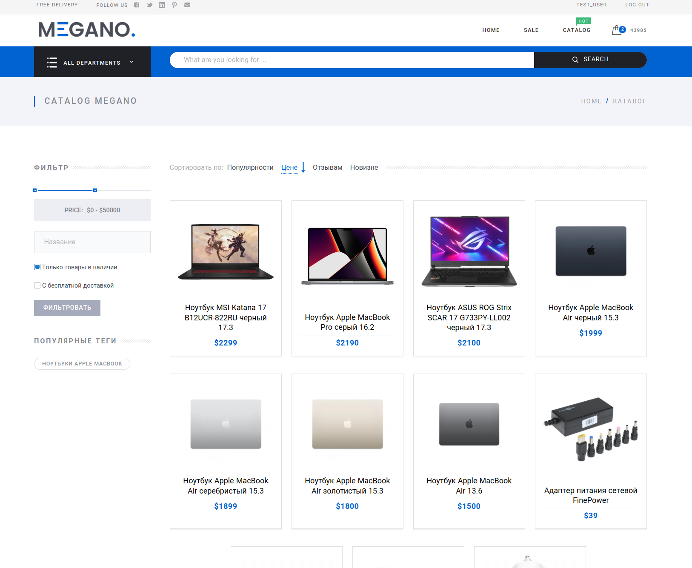
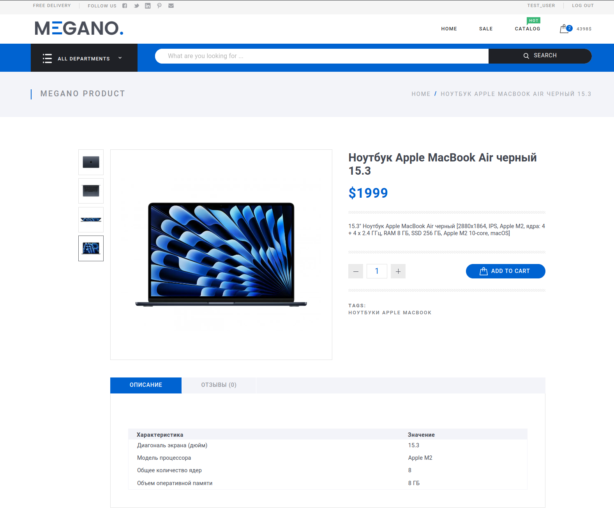
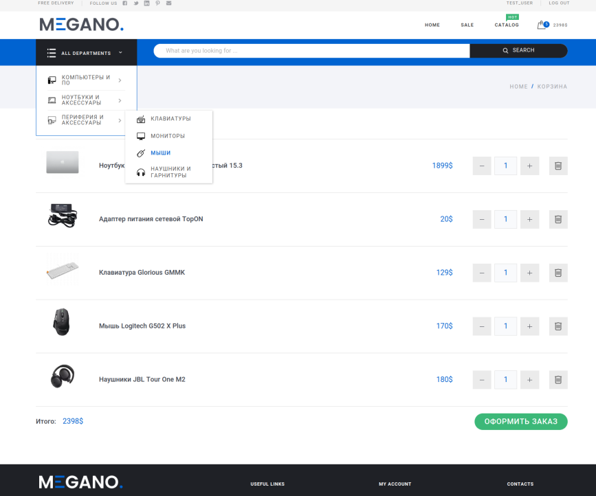
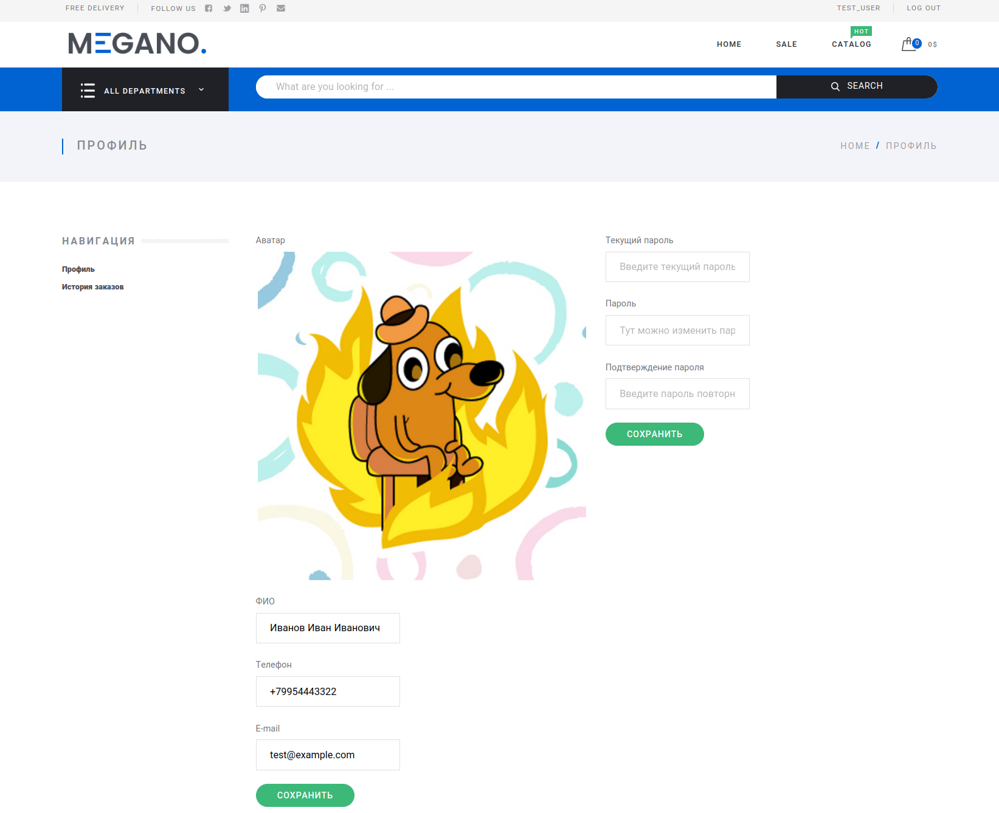

# Marketplace MEGANO

Интернет-магазин для продажи техники

## Описание

Данный проект реализован на веб-фреймворке Django, где за отображение страниц отвечает frontend приложение, 
реализованное с использованием Vue.js. Для передачи данных между фронтендом и бэкендом используется API, 
которое построено с помощью Django Rest Framework. 
Оплата товаров осуществляется через API с применением фреймворка Celery и мокового платежного сервиса, 
реализованного на фреймворке Flask. 
Также для улучшения производительности и масштабируемости проекта была использована технология 
хранения данных в памяти Redis. 
Весь проект упакован в Docker контейнеры для удобной работы и масштабирования.

## Скриншоты интернет-магазина







## Инициализация проекта

- Склонировать проект 
- Выставить желаемые настройки в env
```python 
# DATABASE SETTINGS -------------------
DB_HOST=127.0.0.1
DB_NAME=marketplace_dev
DB_USER=postgres
DB_PORT=5432
DB_PASSWORD=12wqasxz

# PAYMENT API--------------------------
PAYMENT_API_HOST=127.0.0.1
PAYMENT_API_PORT=5000
```
- Сборка проекта
```bash
docker-compose -f docker-compose.yml up -d --build
```
- Создание новых миграций
```bash
docker exec -it megano_django python manage.py makemigrations
```
- Применить миграции 
```bash 
docker exec -it megano_django python manage.py migrate
```
- Заполнить базу данными для разработки и тестирования
```bash
pg_restore -v --no-owner --host=<host> --dbname=<database name> --username=<username> backup_db.dump
```

## Пользователи

**superuser**
- *Логин: admin*
- *Пароль: 12wqasxz*

**user**
- *Логин: test_user*
- *Пароль: 12wqasxz*